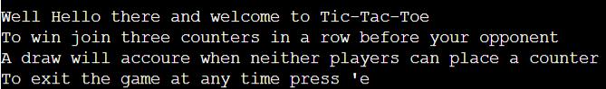
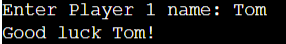
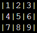
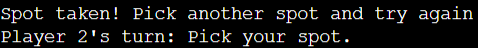
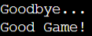
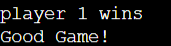
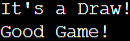

# TIC-TAC-Toe Python

## Introduction

In the game tic-tac-toe you must place three counters in a row to win. The board is 3 x 3. After each time you place a counter your opponent makes their move. If no one wins by the time all the counters are placed, the result is a draw.

My live project [Click Me](https://tic-tac-toe-bc.herokuapp.com/)

## User Experience (UX)

As a new visitor to the site, I want to be able to understand quickly and simply what the game is and how to play.

# Features

## Rules

The instructions for the game appear as you start the program.

## User name input

Each player is then asked for their name. This is so it can be added to Google sheets to keep a record of who wins the game.

## Game board

The game board is 3 x 3. A dictionary was used to map the coordinates and to save the data on the game board.

## Spot validation

If you have already picked a spot on the game board you will get message saying spot has already been taken.

## Exit game

You can exit the game at any time by pressing 'e'.

## Result section

Whoever wins the game will get congratulations.

If it is a draw that will also be acknowledged. 

## Features I'd like to add

- Score counter
- Play against the computer.
- Make the game more visually attractive by adding colour.
- Extra game modes.

## Bugs

## Testing

I have tested this game in the following ways:

- I used the Ad-hoc test in Gitpod while I was making this game.
- I manually tested the game by inputting in invalid data to the terminal, no errors were found.
- I passed my code through the PEP8 validator with no errors.
- I tested the game in the terminal in Heroku, everything worked perfectly.

## Validation Testing

No errors were found when passing through the PEP8 validator.

## Deployment

- Make a clone of your repository.
- Set up a new Heroku app.
- Set the buildpacks to Python and NodeJS.
- Link your repository and your Heroku app.
- Click deploy.

Coding Institute's mock terminal app was used in Heroku.

## Credits

- Thanks to the tutors at Coding Institute and to my mentor Anthony for guiding me through my first project.
- I would also like to thank Katie Duggan for proof reading the content.

## Content

+ Code Institute love_sandwiches. [Coding Institute](https://learn.codeinstitute.net/courses/course-v1:CodeInstitute+LS101+2021_T1/courseware/293ee9d8ff3542d3b877137ed81b9a5b/c92755338ef548f28cc31a7c3d5bfb46/)
+ How to add Json data to a file. [Stack over flow](https://stackoverflow.com/questions/12309269/how-do-i-write-json-data-to-a-file)
+ Dictionary help and board display. [Youtube](https://www.youtube.com/watch?v=Q6CCdCBVypg)
